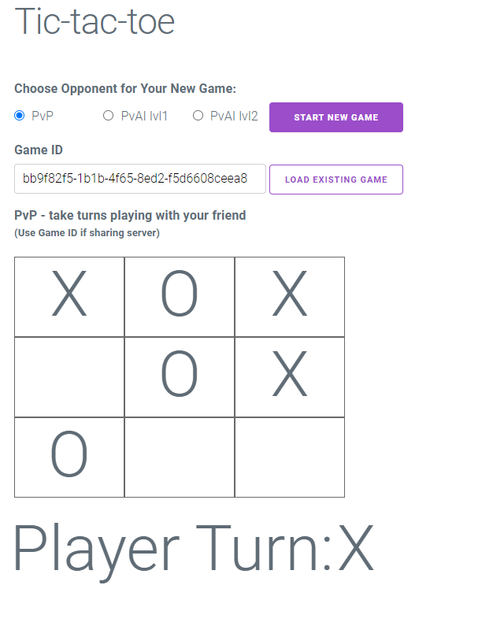

# Tic-tac-toe Game

## Description
Tic-tac-toe is a game with web interface and REST API written in GO.

### Features

#### Game Modes
* PVP - take turns playing with your friend
    * Supports network multiplayer game if the server IP is exposed externally (it will require `game.js` change to point to the IP)
* PvAI lvl1 - play against AI level 1
    * Game against basic AI
* PvAI lvl2 - play against AI level 2
    * Game against more advanced AI

#### Game Server
* Game server is using REST APIs
* Is using port :8080 (TODO: make it configurable)
* Supports maximum 50 active game sessions
* Session max time is 3 hours 
* Thread-safe for the concurrent updates


#### Web UI
* Vue.js and Milligram CSS frameworks
* Long polling for fetching status updates (TODO: use WebSockets)
* Web UI Example:  
    

## Installation

Install GO packages:
```bash
go get "github.com/google/uuid"
go get "github.com/gorilla/mux"
```

Build Server:
```bash
#Windows:
go build .\app\game-server.go

#Mac:
go build ./app/game-server.go
```

## Usage

Start server on Windows:
```bash
game-server.exe
```
Note: The server is using `:8080` port

Open `web\inext.html` with browser

 
## REST API

### Create New Game:
```
POST http://localhost:8080/v1/games HTTP/1.1
content-type: application/json

{
    "GameMode": byte // 0 - PvP, 1 - PvAI lvl1, 2 - PvAI lvl2
}
```

### Get Game Status
```
GET http://localhost:8080/v1/games/{{gameid}} HTTP/1.1
```

### Create Move
```
POST http://localhost:8080/v1/games/{{gameid}}/move HTTP/1.1
content-type: application/json

{
    "X": int,
    "Y": int,
    "Move": string // "X" or "O"
}
```